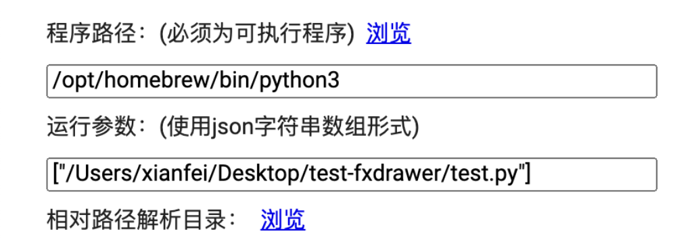

<script type="text/javascript" src="md/jquery-3.4.1.min.js"></script>
<script type="text/javascript" src="md/2html.js"></script>
<script type="text/javascript" src="jquery.js"></script>
<script src="./readme.js"></script>
<link rel="stylesheet" type="text/css" href="md/style.css">
<link rel="stylesheet" type="text/css" href="mdui-v1/css/mdui.css">


> <span>fxDrawer HTML5 Electron 技术预览版 v0.1.2<br>using Node.js <span id="node-version"></span>, Chromium <span id="chrome-version"></span>, and Electron <span id="electron-version"></span> on <span id="system-version"></span>.</span>

一个跨语言跨平台绘图器/图形库，可以当做是一个交互增强版的先进ege/easyx。设计思想类似于ege/easyx，但是支持交互、高分屏、触摸操作等现代GUI技术特性。此版本基于Electron框架开发，这是一个很新的技术框架，Electron在近些年的新软件中很受欢迎，VSCode、GitHub Desktop、Microsoft Teams以及macOS上的百度网盘都是使用该框架开发的。fxDrawer在该框架下也有很大的改进空间，可以增加更多有趣的功能。fxDrawer是一个开源项目，也欢迎大家参与到fxDrawer开发与改进当中。

# 程序介绍

该图形库除了能像图形库一样在编程语言中使用外，还附带了设计辅助工具、开发者工具等工具。在不同操作系统下的UI及使用方式几乎一致，详情请看文档相对应部分。


# API 文档

绘制函数通常会返回objID，保存此objID即可在之后对此对象进行操作。如果之后不需要对这个对象进行操作，可不保存objID。其中`removeByID(objID id)`函数对所有返回objID的绘制对象均有效。

此处使用C语言API作为示范，Python上与大体其一致，只是下文中接受参数`char* stringBuffer`改为返回字符串，接受参数会少一个。<div><label><input type="checkbox" id="conly" checked='true'/>显示C代码</label>&nbsp;&nbsp;<label><input type="checkbox" id="pyonly" checked='true'/>显示Python代码</label></div>

### 控制相关

1. 初始化绘图器

```c
int initDrawer(int width, int height);
// width : 创建窗口宽度
// height : 创建窗口高度
// 返回值：sd number
```
```python
def initDrawer(width,height)
# width : 创建窗口宽度
# height : 创建窗口高度
```
用于初始化绘图器，接受参数为绘图窗口的宽度和高度。

2. 关闭绘图器
```c
void closeDrawer();
```
```python
def closeDrawer()
```

3. 设置颜色

```c
void setColor(int r, int g, int b, double a);
// r : 红色分量，区间为0-255
// g : 绿色分量，区间为0-255
// b : 蓝色分量，区间为0-255
// a : 透明度，区间为0.0-1.0，0.0为全透明，1.0为不透明
void setColorW(const char* color);
// color : web格式色彩，可使用内建的fxColor开头的色彩常量。详情请见'色彩常量'
```
```python
def setColor(r, g, b, a):
# r : rgb颜色红色分量，参数范围0-255
# g : rgb颜色绿色分量，参数范围0-255
# b : rgb颜色蓝色分量，参数范围0-255
# a : 透明度；区间为0.0-1.0，0.0为全透明，1.0为不透明
def setColorW(color);
# color : web格式色彩，可使用内建的fxColor开头的色彩常量。详情请见'色彩常量'
```

用于设置绘图器将要绘图的颜色，RGBa格式，其中色彩分量RGB范围0-255，透明度a范围0-1。

4. 设置描边

```c
void setStroke(int r, int g, int b, double a, double width);
// r : 红色分量，区间为0-255
// g : 绿色分量，区间为0-255
// b : 蓝色分量，区间为0-255
// a : 透明度，区间为0.0-1.0，0.0为全透明，1.0为不透明
// width : 描边宽度，单位为像素
void setStrokeW(const char* color, double width);
// color : web格式色彩，可使用内建的fxColor开头的色彩常量。详情请见'色彩常量'
// width : 描边宽度，单位为像素
```
```python
def setStroke(r, g, b, a, width):
# r : rgb颜色红色分量，参数范围0-255
# g : rgb颜色绿色分量，参数范围0-255
# b : rgb颜色蓝色分量，参数范围0-255
# a : 透明度；区间为0.0-1.0，0.0为全透明，1.0为不透明
# width : 描边宽度，单位为像素
def setStrokeW(const char* color, double width);
# color : web格式色彩，可使用内建的fxColor开头的色彩常量。详情请见'色彩常量'
# width : 描边宽度，单位为像素
```
用于设置绘图器将要绘制图形并描边（仅限draw打头的绘制函数使用），RGBa格式，其中色彩分量RGB范围0-255，透明度a范围0-1，width是描边宽度。不描边时可将后两个值的任意一个设置为0.0即可。

### 绘制图形相关

1. 绘制圆形

```c
objID drawCircle(int x, int y, int radius);
// x : 圆的横坐标
// y : 圆的纵坐标
// radius : 圆的半径
// 返回值：objID
```
```python
def drawCircle(x, y, radius):
# x : 圆的横坐标
# y : 圆的纵坐标
# radius : 圆的半径
# 返回值：objID
```

绘制一个圆，参数为坐标及半径，返回对象的引用ID。

2. 绘制矩形

```c
objID drawRectangle(int x, int y, int width, int height);
// x : 矩形的横坐标
// y : 矩形的纵坐标
// weidth : 矩形的宽
// height : 矩形的高
// 返回值：objID
```
```python
def drawRectangle(x, y, weidth, height):
# x : 矩形的横坐标
# y : 矩形的纵坐标
# weidth : 矩形的宽
# height : 矩形的高
# 返回值：objID，一个整数
```

绘制一个矩形，参数为坐标及宽高，返回对象的引用ID。

3. 绘制n边形

```c
objID drawPolygon(int numberOfPoints, int *xArray, int *yArray);
// numberOfPoints : 多边形定点数
// xArray : 顶点x坐标数组
// yArray : 顶点y坐标数组
// 返回值：objID
```
```python
def drawPolygon(numberOfPoints, xArray, yArray):
# numberOfPoints : 多边形定点数
# xArray : 顶点x坐标数组
# yArray : 顶点y坐标数组
# 返回值：objID，一个整数
```

绘制一个多边形，参数为顶点数、顶点x/y坐标数组，返回对象的引用ID。

4. 绘制点
```c
objID drawPoint(int x, int y, int radius, int smooth);
// x : 圆的横坐标
// y : 圆的纵坐标
// radius : 圆的半径
// smooth： 平滑阈值，0为关闭，此设置为用来平滑的最大距离。可以自行尝试体会一下
```
```python
def drawPoint(x, y, radius, smooth):
# x : 圆的横坐标
# y : 圆的纵坐标
# radius : 圆的半径
# smooth： 平滑阈值，0为关闭，此设置为用来平滑的最大距离。可以自行尝试体会一下
```

绘制一个点，参数为坐标及半径以及平滑阈值

### 放置组件相关

1. 放置文字

```c
objID putText(int x,int y,const char* stringContext,double size);
// x : 放置文字的横坐标
// y : 放置文字的纵坐标
// stringContext : 存放待放置文字的字符串
// size : 放置文字的字体大小
// 返回值：objID
```
```python
def putText(x, y, stringContext, size):
# x : 放置文字的横坐标
# y : 放置文字的纵坐标
# stringContext : 存放待放置文字的字符串
# size : 放置文字的字体大小
# 返回值：objID，一个整数
```

在给定的坐标处放置一段文字，其中size为字体大小，返回对象的引用ID。

2. 放置按钮

```c
objID putButton(int x, int y, int width, int height,const char* stringContext);
// x : 放置按钮的横坐标
// y : 放置按钮的纵坐标
// width : 放置按钮的宽度
// height : 放置按钮的长度
// stringContext : 存放按钮上的文字的字符串
// 返回值：objID
```
```python
def putButton(x, y, width, height, stringContext):
# x : 放置按钮的横坐标
# y : 放置按钮的纵坐标
# width : 放置按钮的宽度
# height : 放置按钮的长度
# stringContext : 存放按钮上的文字的字符串
# 返回值：objID，一个整数
```

放置一个按钮，参数为坐标及宽高及按钮上的文字，返回对象的引用ID。

3. 放置图片

```c
objID putImage(int x, int y, int width, int height,const char* pathString);
// x : 放置图片的横坐标
// y : 放置图片的纵坐标
// width : 放置图片的宽度
// height : 放置图片的长度
// pathString : 存放图片的路径
// 返回值：objID
```
```python
def putImage(x, y, width, hright, pathString):
# x : 放置图片的横坐标
# y : 放置图片的纵坐标
# width : 放置图片的宽度
# height : 放置图片的长度
# pathString : 存放图片的路径
# 返回值：objID，一个整数
```

放置一张图片，参数为坐标及宽高及图片的路径，返回对象的引用ID。

4. 放置输入框

```c
objID putInputBox(int x, int y, int width, int height,const char* type);
// x : 放置输入框的横坐标
// y : 放置输入框的纵坐标
// width : 放置输入框的宽度
// height : 放置输入框的长度
// 返回值：objID
```
```python
def putInputBox(x, y, width, height):
# x : 放置输入框的横坐标
# y : 放置输入框的纵坐标
# width : 放置输入框的宽度
# height : 放置输入框的长度
# 返回值：objID，一个整数
```

放置一个输入框，参数为坐标及宽高，返回对象的引用ID。

### 弹出对话框

1. 弹出文件选择窗口

```c
void chooseFile(char* stringBuffer);
// stringBuffer : （作为返回值） 文件目录字符串
```
```python
def chooseFile()
# 返回值: 文件目录字符串
```
用于选择文件，接受参数为存放文件路径字符串缓冲区指针。<a class="fxdrawerdemobut" id="fileChooserBut" onclick="alert(remote.dialog.showOpenDialogSync())">点击这里查看预览</a>

2. 弹出文件保存窗口

```c
void chooseSaveFile(char* stringBuffer);
// stringBuffer : （作为返回值） 文件目录字符串
```
```python
def chooseSaveFile()
# 返回值: 文件目录字符串
```
用于保存文件，接受参数为存放文件路径字符串缓冲区指针。<a class="fxdrawerdemobut" id="fileSaveBut" onclick="alert(remote.dialog.showSaveDialogSync())">点击这里查看预览</a>

3. 弹出选择对话框

```c
int showChooseDialog(const char* stringContext,const char* options);
// title: 标题
// stringContext: 提示文本
// options: 选项，用|分隔，如无需选项可传入NULL或空串
// 返回值：选项
```
```python
def showChooseDialog(stringContext, options):
# stringContext: 提示文本
# options: 选项，用|分隔，如无需选项可传入NULL或空串
# 返回值：选项
```

用于创建一个选择对话框，接受参数为内容及选项，其中选项之间用|分隔。返回值为选项的编号-1，从0开始，直接关闭也返回0。例如对于代码 `showChooseDialog("这里是显示的内容","选项1|选项2|选项3|选项4");` 而言，弹出窗口如图所示，点击选项1是返回0，点击选项2是返回1。<a class="fxdrawerdemobut" id="dialogBut" onclick="alert('返回值为'+remote.dialog.showMessageBoxSync({message:'这里是显示的内容',buttons:['选项1','选项2','选项3','选项4']}))">点击这里查看预览</a>

4. 弹出输入对话框
```c
void showInputDialog(char* stringBuffer);
// stringBuffer: （作为返回值）用于存放输入的内容
```
```python
def showInputDialog()
# 返回值: 输入的内容
```

可以输入一行或多行文本，<a class="fxdrawerdemobut" id="fileSaveBut" onclick="mdui.prompt('这是一个多行文本框',function (value) { mdui.alert('你输入了：' + value + '，点击了确认按钮');}, void ,{ type: 'textarea' });">点击这里查看预览</a>

### 交互处理

以下为阻塞式交互相应机制，可以看一看示例进行理解

1. 等待按键/图片的点击响应

```c
objID waitForClick();
// 返回值: 点击（对于按钮）/发生修改（对于input）的id
```
```python
def waitForClick():
# 返回值: 点击（对于按钮）/发生修改（对于input）的id
```

等待用户点击绘图窗口上的一个按钮（如果input更改返回input id），如果用户点击，则返回点击的按钮ObjID，如果未点击任何按钮则无限等待。

2. 等待空白处的点击响应

```c
void waitForClickXy(int* x, int* y);
// x,y : 点击的坐标
```
```python
def waitForClickXy():
# 返回值: 包含两个坐标的数组
```

3. 等待各种响应

```c
void waitForAny(char* stringBuffer) ;
// stringBuffer : （作为返回值）: 如果点击控件或改变input值返回字符串  id:控件id  点击空白处返回  xy:x坐标,y坐标  按下键盘返回  kb:键值
```
```python
def waitForAny():
# 返回值:  如果点击控件或改变input值返回字符串  id:控件id  点击空白处返回  xy:x坐标,y坐标  按下键盘返回  kb:键值
```

### 更改及获取相关

1. 改变文本

```c
void changeText(objID id,const char* stringContext);
// id : 需要改变文本的对象id
// stringContext : 需要修改文本的字符串
```
```python
def changeText(id, stringContext):
# id : 需要改变文本的对象id
# stringContext : 需要修改文本的字符串
```

用于改变文本框、输入框或按钮的文本内容，接受参数为需要改变的对象引用ID及文字。

2. 改变路径

```c
void changePath(objID id,const char* stringContext);
// id : 需要改变的对象id
// stringContext : 修改后路径的字符串
```
```python
def changePath(id, stringContext):
# id : 需要改变图像路径的图像id
# stringContext : 存放待修改路径的字符串
```

用于改变图片显示的文件路径，接受参数为需要改变的对象引用ID及文件路径。

3. 改变位置

```c
void changePosition(objID id,int x,int y);
// id : 需要改变位置的图片的id
// x : 目标横坐标
// y : 目标纵坐标
```
```python
def changePosition(id, x, y):
# id : 需要改变位置的图片的id
# x : 目标横坐标
# y : 目标纵坐标
```

用于改变对象的位置，对于绘制的图形改变的是相对位置，对于放置的控件改变的是绝对位置（自己试试就知道了）。


4. 删除对象

```c
void removeByID(objID id);
// id : 需要删除的对象引用ID
```
```python
def removeByID(id):
# id : 需要删除的对象引用ID
```

用于删除窗口上的一个对象，接受参数为需要删除的对象引用ID。

5. 获取文字

```c
void getText(objID id,char* stringBuffer);
// id: 对象ID
// stringBuffer: （作为返回值）文件目录字符串
```
```python
def getText(id)
# id: 对象ID
# 返回值: 文件目录字符串
```
用于获取文本框/放置的文字/按钮中的文字，接受参数为对象ID及存放文字的字符串缓冲区指针。

6. 调取JavaScript解释器
```c
void executeJs(const char* code,char* stringBuffer);
// code: JavaScript语句
// stringBuffer : （作为返回值）为JavaScript语句执行结果，调用eval函数，原生类型以字符串形式，对象以Json形式。
```
```python
def executeJs(code)
# code: JavaScript语句
# 返回值 : 为JavaScript语句执行结果，调用eval函数，原生类型以字符串形式，对象以Json形式。
```
用于调取fxDrawer内置的JavaScript解释器，code为JS代码，stringBuffer为返回值（原生类型以字符串形式，对象以Json形式）。详情请见JS解释器部分。

### 高级设置

`注意：如果不懂可以直接跳过这些`

```c++
// 设置要连接的fxDrawer端口号，默认6666
void fxSetPort(int port);

// 设置要连接的fxDrawer端口号，默认127.0.0.1
void fxSetHost(const char* host);

// 设置当前使用的Socket描述号，默认由initDrawer函数赋值，可在多窗口时使用
void fxSetSd(int sd);

// 设置是否在窗口关闭后杀死调用者 默认为true或1
void fxSetKillAfterCloseWindow(int isIt);

// 设置是否在调用者断开连接后窗口关闭 默认为false或0
void fxSetCloseOnBroke(int isIt);
```

### 色彩常量

色彩常量以fxColor开头，包含了所有您喜欢的颜色，详情请见下表：

<div id="fxcolortable"></div>

# 示例

1. 基本语法展示 （c/python）

https://github.com/xianfei/fxdrawer/tree/master/Adapter%26Demo/fxDrawer-c-demo

https://github.com/xianfei/fxdrawer/tree/master/Adapter%26Demo/fxDrawer-python-demo


2. 中国麻将Demo （c++）

https://github.com/xianfei/fxdrawer/tree/master/Adapter%26Demo/fxDrawer-c-demo-mahjong


3. 画板 （c）

https://github.com/xianfei/fxdrawer/tree/master/Adapter%26Demo/fxDrawer-c-demo-paint

# 开发者工具

fxDrawer 得益于Electron框架，内建了Chromium网页调试器，你可以通过它快速查看布局及objID，以及从Console中读取错误信息等。


# 设计辅助工具

fxDrawer 内建了一套绘图辅助工具，可以显示网格（每格为50px）及当前坐标，同时可以拖拽产生矩形框快速生成x,y坐标及w,h宽高信息，方便绘制图形及控件。


# WebServer

fxDrawer Web Server 技术可以将已经编写好使用fxDrawer图形库的本地应用转换为使用浏览器通过HTTP访问的Web应用程序，您只需提供启动您的程序的方法即可。

1. 启动方法

您可以点击欢迎页面上的地球图标打开WebServer控制器，也可以在终端/cmd中输入`fxdrawer server`来启动控制器。


2. 参数说明

- 程序路径：客户端建立连接后要启动的程序可执行文件路径

- 运行参数：（可空）向程序路径对应的可执行文件传入的启动参数

- 相对路径解析目录：（可选）如果您在程序中使用fxDrawer绘制了图片或视频，且他们使用了相对路径，您需要在此处填写相对路径初始路径

- HTTP端口：HTTP协议监听端口，默认为80

- fxdPort：fxDrawer程序通信端口，默认为6666

3. 使用说明：

对于C/C++程序，请将您的程序的绝对路径填入‘程序路径’输入框中。对于Python程序，请将Python解释器路径填入‘程序路径’输入框中(可通过`where python`获得)，并将py文件填入运行参数数组中，如图：



# JS解释器

该图形库开放JavaScript解释器接口，可以使用JQuery等语句对对象进行更多操作。例如获取objID为2110的对象的文本内容，可使用语句

```c
char result[64];
executeJs("$('#2110').text()",result);
printf(result);
```

# 特性

1. 多语言适配——在C语言/Python中的使用方式几乎完全一致，未来还会支持更多语言


2. 面向过程——方便初学者

3. 安装简单

4. 无需重新编译即可作为Web应用使用

5. 待补充……


# 更新日志

### 已知bug

1. ~~Windows下的GB2312编码输出问题，中文乱码~~ （在msvc上已解决，dev-c++可能不太行，如果遇到乱码可以尝试将代码文件另存为utf-8编码格式）

2. WebServer Virtual Path 安全性问题 （将会在后续版本解决）

### 版本发行说明

- 0.1.2 beta 2021.2

合并fxDWebServ

增加HTML颜色支持

- 0.1.1 beta 2021.1

修复大量bug、增加绘图辅助工具

- 0.1.0 beta 2021.1

重构绘图器/渲染器，改用Electron技术栈

（可能接着也会维护javafx版本）

- 0.0.8 alpha 2021.1

增加了对于Python语言的支持

增加了macOS对touchbar的支持

增加了绘图描边选项

- 0.0.6 alpha 2020.4

修正了在vs上的一些链接错误

拆分.h .cpp .c 文件

- 0.0.5 alpha 2020.2

增加openjdk11+openjfx11分之

发布第一个release版本

- 0.0.4 alpha 2020.2

修复了文字显示删除上的一些bug

添加了弹出对话框

添加了文件选择器

- 0.0.3 alpha 2020.2

添加文本输入支持

添加图片支持

添加图片作为可点击对象

- 0.0.2 alpha 2020.1

支持绘制可选择可复制的文字

原生按键响应

基于ObjID的删改体系

- 0.0.1 frist alpha version 2019.12

绘制基本图形 内建了圆形、矩形和n个顶点的n边形

绘图器和C语言程序联动 关闭绘图窗口后自动结束进程 反之亦然

### 测试性特征/Todo

- 半透明/毛玻璃窗体背景 (当前仅限文档窗口sidebar，将来可能可选应用到全局)(在Windows上效果不理想)


- 音视频支持

# 定制fxDrawer

这是一个开源项目，项目地址：https://github.com/xianfei/fxdrawer

fxDrawer发行版内包含源代码，且可直接修改fxDrawer源代码后无需编译，再次打开fxDrawer即可生效。有好的修改欢迎在GitHub该项目中提交Pull request

> fxDrawer Source Code Path:
> Windows: %FXDRAWER_HOME%\resources\app
> macOS: /Applications/fxdrawer.app/Contents/Resources/app

# 结束语

>大二上学期期末之前偶然想到的点子，当时刚学完Java然后感觉每门语言的图形库都不太一样好烦，而且ege这个东西太古老了做个鼠标交互以及在retina屏幕上都好难受于是打算自己开发一款图形库，毕竟是自己维护所以想到什么功能就加上了，许多功能都是受ege启发所以感觉用起来应该会和ege很像，甚至可以封装成和ege一模一样。毕竟是自己写的库不一定好用，ege也有个十多年历史了吧，如果有问题可以进行反馈（不过之后我应该要忙着考研了）。这个项目大创定级只评了C我也不知道是评委老师没看懂还是不看好这个项目，不过话说从最开始写第一版到现在已经有一年多了，大三好忙呀，各位加油喔。
>—— 计算机学院  软件工程  18级  王衔飞   2021.1

Powered by: 


Copyright © 2019-2021 Xianfei. All rights reserved.