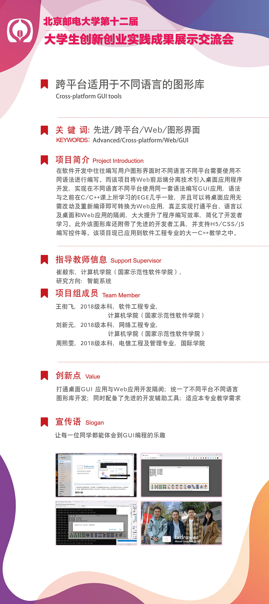

跨平台适用于不同语言的图形库。目前适配C/C++、Python语言，在macOS/Windows平台下的CLion 2020/Visual Studio 2019、Pycharm 2020通过测试。

Cross-platform graphics library for different languages. Currently adapted to C/C++, Python language, CLion 2020/Visual Studio 2019, Pycharm 2020 under macOS/Windows platform passed the test.

### 0. 项目简介 Project Introduction

在软件开发中往往编写用户图形界面时不同语言不同平台需要使用不同语法进行编写。而该项目将Web前后端分离技术引入桌面应用程序开发，实现在不同语言不同平台使用同一套语法编写GUI应用，语法与之前在C/C++课上所学习的EGE相似，并且可以将桌面应用无需改动及重新编译即可转换为Web应用，真正实现打通平台、语言以及桌面和Web应用的隔阂，大大提升了程序编写效率，简化了开发者学习。此外该图形库还附带了先进的开发者工具，并支持H5/CSS/JS编写控件等。该项目现已应用到软件工程专业的大一C++教学之中。

In software development, it is often necessary to use different syntaxes for writing user GUIs in different languages and on different platforms. This project introduces Web front-end and back-end separation technology to desktop application development, realizing the use of the same set of syntax to write GUI applications in different languages and platforms, the syntax is similar to the EGE learned in C/C++ class, and can convert desktop applications to Web applications without changes and recompilation, truly bridging the gap between platforms, languages, and desktop and Web applications. This truly bridges the gap between platforms, languages, and desktop and web applications, greatly improving the efficiency of writing programs and simplifying learning for developers. In addition, the graphics library comes with advanced developer tools and supports H5/CSS/JS writing controls. The project has been applied to the first-year C++ teaching of software engineering.

### 1. 特色功能 Features

- 支持高分屏、抗锯齿、触摸屏、键盘触摸条等炫酷功能

- 跨平台、跨语言

- 模仿ege/easyx进行开发，但比他们更简单更好用

- 打通桌面GUI程序/Web程序，无需修改及重新编译即可将桌面程序转换为Web程序

- Support HiDPI, anti-aliasing, touch screen, keyboard touchbar (on some MacBook) and other cool features

- Cross-platform and cross-language

- Using like ege/easyx (Which have been used in most teaching environments), but more simple and better than them

- Unified desktop GUI program/Web program, no need to modify and recompile to convert desktop program to Web program

### 2. 使用手册 API/Usage Document

[点击查看](RenderApp/fxdrawer/readme.md)

当您安装好fxDrawer后，可在程序内查看使用手册。

Once you have installed fxDrawer, you can view the manual inside the program.

### 3. 安装 Install

在[Release页面](https://github.com/xianfei/fxdrawer/releases/)中下载对应系统的程序包，解压后放置到任意喜欢位置（macOS中建议将程序拖拽至 应用程序 文件夹），运行程序（Windows下为fxdrawer.exe）并按照程序提示添加PATH目录，编程时可将libs文件夹中对应语言的库复制到您的项目中。

Download the package from [Release](https://github.com/xianfei/fxdrawer/releases/), unzip it and place it in any location you like (in macOS it is recommended to drag and drop the program to the application folder), run the program (fxdrawer.exe on Windows) and follow the program prompts to add the PATH directory, and copy the libraries of the corresponding language from the libs folder to your project when programming.

### 4. 编译 Development

依赖：NodeJS环境

1. 克隆该项目(或下载代码压缩包并解压)并进入文件夹内

2. `cd RenderApp/fxdrawer`

3. 解决依赖 `npm i`

4. 编译`npm run package`(如果只想编译某一平台可进行指定，如`npm run package:win64`)

5. 生成的文件在RenderApp/fxdrawer/OutApp下

Dependencies: NodeJS environment

1. Clone the project (or download the code zip and unzip it) and go to the folder

2. `cd RenderApp/fxdrawer`.

3. resolve the dependency `npm i`

4. compile `npm run package` (if you only want to compile for a certain platform, you can specify it, e.g. `npm run package:win64`)

5. generate the files under RenderApp/fxdrawer/OutApp

### 5. 附录 What's more

该项目为2020-2021北京邮电大学大学生创新创业大赛项目。

北京邮电大学第十二届大学生创新创业实践成果展示交流会 宣传展板：

