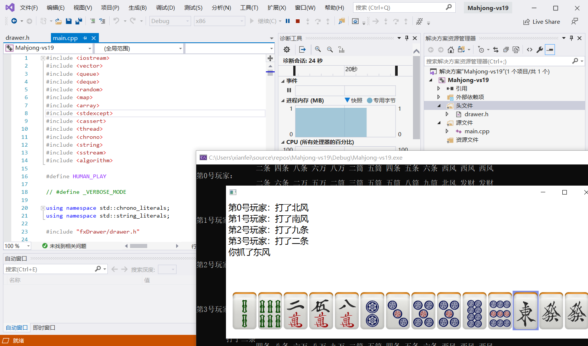
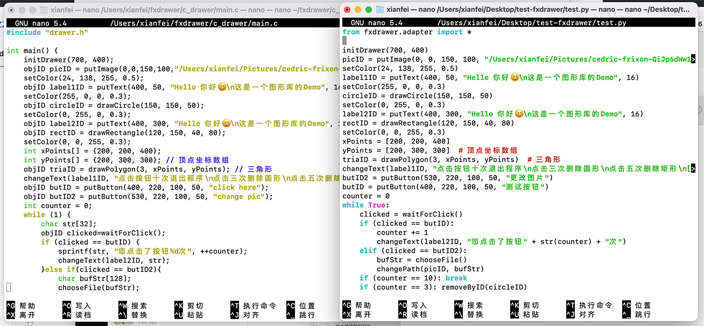

>为0.0.8版本编写  2020.1

# fxDrawer by xianfei

一个会让你喜欢的通用语言跨平台使用极其简单的面向过程绘图器。


目前适配C/C++、Python语言，在macOS/Windows平台下的CLion 2020/Visual Studio 2019、Pycharm 2020通过测试。

## 0. 来唠唠嗑

>大二上学期期末之前偶然想到的点子，当时刚学完Java然后感觉每门语言的图形库都不太一样好烦，而且ege这个东西太古老了做个鼠标交互以及在retina屏幕上都好难受于是打算自己开发一款图形库，毕竟是自己维护所以想到什么功能就加上了，许多功能都是受ege启发所以感觉用起来应该会和ege很像，甚至可以封装成和ege一模一样。毕竟是自己写的库不一定好用，ege也有个十多年历史了吧，如果有问题可以进行反馈（不过之后我应该要忙着考研了）。这个项目大创定级只评了C我也不知道是评委老师没看懂还是不看好这个项目，不过话说从最开始写第一版到现在已经有快一年了，大三好忙呀，各位加油喔。
>-- 计算机学院  软件工程  18级  王衔飞   2021.1

## 1. 特色功能

- 支持高分屏、抗锯齿、触摸屏、键盘触摸条等炫酷功能

- 跨平台、跨语言

- 模仿ege/easyx进行开发，但比他们更简单更好用

## 2. 使用手册

### a) 总览

绘制函数通常会返回objID，保存此objID即可在之后对此对象进行操作。如果之后不需要对这个对象进行操作，可不保存objID。其中`removeByID(objID id)`函数对所有返回objID的绘制对象均有效。

### b) 配置方法

#### Windows VS2019

##### 快速使用方法

将fxDrawer文件夹拷贝到项目文件夹中，在“解决方案资源管理器”中选择当前项目的“头文件”，右键-添加-现有项，将fxDrawer文件夹中的drawer.h添加，并在“源文件”中添加drawer.c(针对c语言)drawer.cpp(针对c++)，并在首行 `#include "fxDrawer/drawer.h"` 后即可使用。



##### 安装使用方法

将fxDrawer文件夹拷贝到系统环境变量PATH之一的文件夹内（除system32），也可将fxDrawer拷贝到任意文件夹，并将其上级文件夹添加到系统环境变量PATH中。然后将fxDrawer文件夹中的drawer.h及drawer.c(针对c语言)drawer.cpp(针对c++)拷贝到vs头文件目录（默认为 `C:\Program Files (x86)\Microsoft Visual Studio\20XX\<Community/Profeccsional/Enterprise>\VC\Tools\MSVC\<版本号>\include` ）中，并在之后使用时首行添加 `#include <drawer.h>` 后即可使用。

##### 发布打包方法

将vs生成的exe文件与fxDrawer文件夹放在同一文件夹内即可，建议使用7zip打包（使用7z格式压缩文件在二十兆左右，使用zip格式在三十兆左右）。

### c) APIs:

此处使用C语言API作为示范，Python上与大体其一致，只是下文中接受参数`char* stringBuffer`改为返回字符串，接受参数会少一个

#### 控制相关

1. 初始化绘图器

```c
int initDrawer(int width, int height);
```
用于初始化绘图器，接受参数为绘图窗口的宽度和高度。

2. 设置颜色

```c
void setColor(int r, int g, int b, double a);
```
用于设置绘图器将要绘图的颜色，RGBa格式，其中色彩分量RGB范围0-255，透明度a范围0-1。

3. 设置描边

```c
void setStroke(int r, int g, int b, double a, double width);
```
用于设置绘图器将要绘制图形并描边（仅限draw打头的绘制函数使用），RGBa格式，其中色彩分量RGB范围0-255，透明度a范围0-1，width是描边宽度。不描边时可将后两个值的任意一个设置为0.0即可。

#### 绘制图形相关

1. 绘制圆形

```c
objID drawCircle(int x, int y, int radius);
```
绘制一个圆，参数为坐标及半径，返回对象的引用ID。

2. 绘制矩形

```c
objID drawRectangle(int x, int y, int width, int height);
```
绘制一个矩形，参数为坐标及宽高，返回对象的引用ID。

3. 绘制n边形

```c
objID drawPolygon(int numberOfPoints, int *xArray, int *yArray);
```
绘制一个多边形，参数为顶点数、顶点x/y坐标数组，返回对象的引用ID。

#### 放置组件相关

1. 放置文字

```c
objID putText(int x,int y,const char* stringContext,double size);
```
在给定的坐标处放置一段文字，其中size为字体大小，返回对象的引用ID。

2. 放置按钮

```c
objID putButton(int x, int y, int width, int height,const char* stringContext);
```
放置一个按钮，参数为坐标及宽高及按钮上的文字，返回对象的引用ID。

3. 放置图片

```c
objID putImage(int x, int y, int width, int height,const char* pathString);
```
放置一张图片，参数为坐标及宽高及图片的路径，返回对象的引用ID。

4. 放置输入框

```c
objID putInputBox(int x, int y, int width, int height);
```
放置一个输入框，参数为坐标及宽高，返回对象的引用ID。

#### 更改及交互相关：

1. 改变文本

```c
void changeText(objID id,const char* stringContext);
```
用于改变文本框、输入框或按钮的文本内容，接受参数为需要改变的对象引用ID及文字。

2. 改变路径

```c
void changePath(objID id,const char* stringContext);
```
用于改变图片显示的文件路径，接受参数为需要改变的对象引用ID及文件路径。

3. 改变位置

```c
void changePosition(objID id,int x,int y);
```
用于改变对象的位置，对于绘制的图形改变的是相对位置，对于放置的控件改变的是绝对位置（自己试试就知道了）。

4. 等待按键/图片的点击响应（**阻塞式响应**）

```c
objID waitForClick();
```
等待用户点击绘图窗口上的一个按钮（新版本加入图片支持），如果用户点击，则返回点击的按钮ObjID，如果未点击任何按钮则无限等待。

5. 删除对象

```c
void removeByID(objID id);
```
用于删除窗口上的一个对象，接受参数为需要删除的对象引用ID。

6. 获取文字

```c
void getText(objID id,char* stringBuffer);
```
用于获取文本框/放置的文字/按钮中的文字，接受参数为对象ID及存放文字的字符串缓冲区指针。

7. 弹出文件选择窗口

```c
void chooseFile(char* stringBuffer);
```
用于选择文件，接受参数为存放文件路径字符串缓冲区指针。
 

8. 弹出选择对话框

```c
int showChooseDialog(const char* title,const char* stringContext,const char* options);
```
用于创建一个选择对话框，接受参数为标题、内容及选项，其中选项之间用|分隔。返回值为选项的编号，从1开始，返回0表示关闭了对话框或点击了取消。例如对于代码 `showChooseDialog("这里是标题","这里是显示的内容","选项1|选项2|选项3|选项4");` 而言，弹出窗口如图所示，点击选项1是返回1，关闭或点击cancel返回0。
 

## 3. 示例

见项目中c语言和Python的demo项目 (几乎一样喔~)



## 4. Bug List

### 已知bug

1. ~~Windows下的GB2312编码输出问题，中文乱码~~ （在msvc上已解决，dev-c++可能不太行，如果遇到乱码可以尝试将代码文件另存为utf-8编码格式）

### bug反馈要求

请在代码第一行前添加一行 `#define _VERBOSE_MODE` 并将输出信息和问题报告给我~

## 5. 平台兼容性

MacBook Pro  (Apple silicon M1)  macOS 11.0.1 c/c++(clion) 、 python(pycharm) 测试通过

黑苹果台式机  (Intel i7-4790k)  macOS 10.15.4 c/c++(clion) 、 python(pycharm) 测试通过

HP笔记本 (Intel i5-8250u)  Windows 10   c/c++(clion/VS2019) 、 python(pycharm) 测试通过

## 6. 平台特性

- 在macOS上支持带有touchBar的MacBook Pro，在创建按钮时会自动添加到touch bar（左端作为栈顶）


## 7. 更新日志

- 0.0.8 alpha 2021.1

增加了对于Python语言的支持

增加了macOS对touchbar的支持

增加了绘图描边选项

- 0.0.6 alpha 2020.4

修正了在vs上的一些链接错误

拆分.h .cpp .c 文件

- 0.0.5 alpha 2020.2

增加openjdk11+openjfx11分之

发布第一个release版本

- 0.0.4 alpha 2020.2

修复了文字显示删除上的一些bug

添加了弹出对话框

添加了文件选择器

- 0.0.3 alpha 2020.2

添加文本输入支持

添加图片支持

添加图片作为可点击对象

- 0.0.2 alpha 2020.1

支持绘制可选择可复制的文字

原生按键响应

基于ObjID的删改体系

- 0.0.1 frist alpha version 2019.12

绘制基本图形 内建了圆形、矩形和n个顶点的n边形

绘图器和C语言程序联动 关闭绘图窗口后自动结束进程 反之亦然

## 8. Todo List

- [x] 放置输入框并读取内容

- [x] 放置图片

- [ ] 放置音视频播放器

- [ ] 放置Web浏览器

## 9. 鸣谢及开源许可

该项目使用了以下开源项目作为组件，特此鸣谢。

 名称 | 许可证 | Github链接 | 备注
 --- | --- | --- | ---
  fastjson | Apache-2.0 | [Link](https://github.com/alibaba/fastjson) | Java json解析
  cJSON | MIT License | [Link](https://github.com/DaveGamble/cJSON) | C json解析
  EmojisFX | MIT License | [Link](https://github.com/Madeorsk/EmojisFX) | Emoji输出支持
  JTouchBar | MIT License | [Link](https://github.com/Thizzer/jtouchbar) | Touchbar支持
  SVG Salamander | LGPL and BSD | [Link](https://github.com/blackears/svgSalamander) | SVG渲染
  

